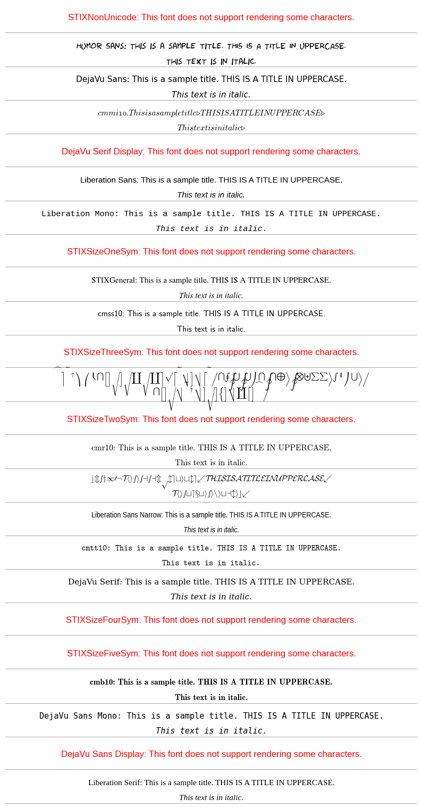

# Visual Font Guide in Matplotlib

## Overview
This repository contains a Jupyter Notebook (`matplotlib_font_families_tutorial.ipynb`) that provides a visual guide to the default font families available in Matplotlib. It is designed to help users see how each font family looks and performs in a plot, making it easier to select the right font for your data visualization needs.



## Getting Started

### Prerequisites
To run the notebook, you will need Python and the following packages:
- matplotlib

### Installation
Clone the repository and install the required packages:
```bash
git clone https://github.com/carogaltier/matplotlib-fonts.git
cd matplotlib-fonts
pip install matplotlib
```

### Running the Notebook
Open the notebook using Jupyter Notebook or JupyterLab:
```bash
jupyter notebook matplotlib_font_families_tutorial.ipynb
```

### Author

**María Carolina González Galtier**

- [Profile](https://github.com/carogaltier "María Carolina González Galtier")

### License
[GNU General Public License v3.0](https://choosealicense.com/licenses/gpl-3.0/)

### 🤝 Support

Contributions, issues, and feature requests are welcome!
Give a ⭐️ if you like this project!
