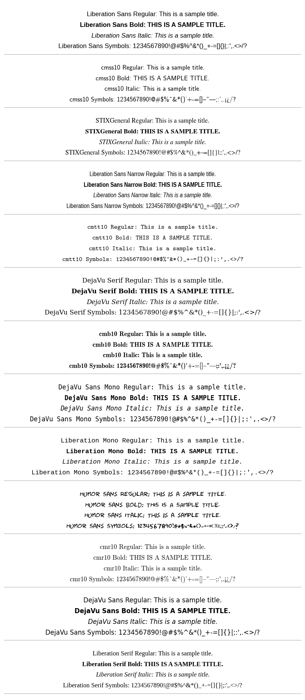

# Visual Font Guide in Matplotlib

## Overview
This repository contains a Jupyter Notebook (`matplotlib_font_families_tutorial.ipynb`) that provides a visual guide to the default font families available in Matplotlib. It is designed to help users see how each font family looks and performs in a plot, making it easier to select the right font for your data visualization needs.

## Getting Started

### Prerequisites
To run the notebook, you will need Python and the following packages:
- matplotlib

### Installation
Clone the repository and install the required packages:
```bash
git clone https://github.com/carogaltier/matplotlib-fonts.git
cd matplotlib-fonts
pip install matplotlib
```

### Running the Notebook
Open the notebook using Jupyter Notebook or JupyterLab:
```bash
jupyter notebook matplotlib_font_families_tutorial.ipynb
```

## Available Font Names
The following is a list of all font families available by default in Matplotlib:
- Liberation Sans
- cmss10
- STIXSizeOneSym
- cmsy10
- cmmi10
- DejaVu Sans Display
- STIXGeneral
- Liberation Sans Narrow
- cmtt10
- STIXSizeFourSym
- DejaVu Serif
- STIXSizeThreeSym
- cmb10
- DejaVu Serif Display
- STIXNonUnicode
- DejaVu Sans Mono
- Liberation Mono
- Humor Sans
- cmr10
- DejaVu Sans
- STIXSizeFiveSym
- cmex10
- STIXSizeTwoSym
- Liberation Serif

### Fonts That Do Not Render All Glyphs
The following fonts have been identified to have issues rendering all glyphs:
- STIXSizeOneSym
- DejaVu Sans Display
- STIXSizeFourSym
- STIXSizeThreeSym
- DejaVu Serif Display
- STIXNonUnicode
- STIXSizeFiveSym
- STIXSizeTwoSym

### Fonts with Text Rendering Issues
These fonts display text using symbols or do not space characters correctly, and thus are not suitable for standard text rendering:
- cmmi10
- cmsy10
- cmex10

### Fonts That Render Successfully
The following fonts have been tested and found to successfully render text without any issues:
- Liberation Sans
- cmss10
- STIXGeneral
- Liberation Sans Narrow
- cmtt10
- DejaVu Serif
- cmb10
- DejaVu Sans Mono
- Liberation Mono
- Humor Sans
- cmr10
- DejaVu Sans
- Liberation Serif



### Author

**María Carolina González Galtier**

- [Profile](https://github.com/carogaltier "María Carolina González Galtier")

### License
[GNU General Public License v3.0](https://choosealicense.com/licenses/gpl-3.0/)

### 🤝 Support

Contributions, issues, and feature requests are welcome!
Give a ⭐️ if you like this project!
